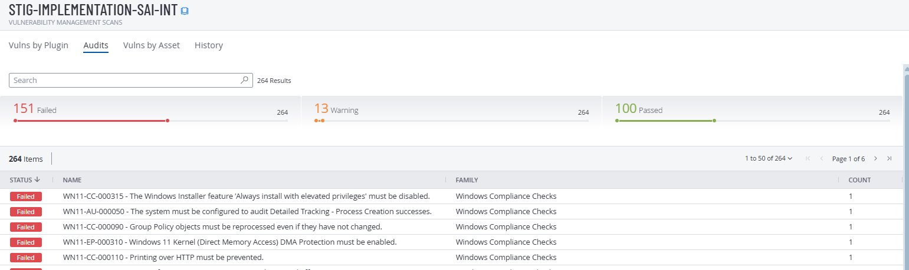

# Windows 11 STIG Remediation

This repository documents how I systematically identified, remediated, and automated fixes for 10 failed DISA Windows 11 STIG compliance checks on a Microsoft Azure VM using Tenable Nessus.

All 10 STIGs were selected based on direct relevance to SOC operations, threat hunting, and credential security - not random compliance checkboxes. Each one maps to a real attack technique that shows up in production environments.

## Table of Contents

1. [Project Overview](#project-overview)
2. [Remediation Workflow](#remediation-workflow)
3. [STIG Controls Remediated](#stig-controls-remediated)
4. [Why These 10 STIGs Matter](#why-these-10-stigs-matter)
5. [About the PowerShell Scripts](#about-the-powershell-scripts)
6. [Scripts](#scripts)
7. [Baseline Scan](#baseline-scan)
8. [Final Results](#final-results)
9. [Troubleshooting](#troubleshooting)

---

## Project Overview

| Component | Details |
|-----------|---------|
| OS | Windows 11 |
| STIG Baseline | DISA Windows 11 STIG v2r2 |
| Scan Tool | Tenable Nessus (cloud.tenable.com) |
| VM Platform | Microsoft Azure |
| Scan Engine | LOCAL-SCAN-ENGINE-01 |

---

## Remediation Workflow

Every STIG in this project went through the same 6-step process:
1. **Baseline scan** - Identified as Failed in Tenable Nessus
2. **Manual fix** - Applied via Registry Editor or Local Security Policy
3. **Rescan** - Verified as Passed
4. **Revert** - Undid the fix, confirmed it fails again
5. **Automate** - Applied the same fix using a PowerShell script
6. **Final rescan** - Verified as Passed, captured before/after evidence

---

## STIG Controls Remediated

Each row links to a detailed breakdown in the [`docs/`](docs/) folder covering the vulnerability, MITRE ATT&CK mapping, manual fix steps, PowerShell automation, verification commands, rollback instructions, and evidence screenshots.

| Group | STIG ID(s) | Summary | MITRE ATT&CK | Docs |
|-------|-----------|---------|---------------|------|
| 1 | WN11-AU-000500 / -000505 / -000510 | Event log sizes must meet minimum thresholds | T1070.001 - Clear Event Logs | [Event Log Sizes](docs/Group1-EventLogSizes.md) |
| 2 | WN11-CC-000326 / -000327 / -000066 | PowerShell script block, transcription, and command line logging | T1059.001 / T1059.003 - PowerShell & Cmd | [PowerShell Logging](docs/Group2-PowerShellLogging.md) |
| 3 | WN11-CC-000038 / WN11-SO-000205 | Disable WDigest, enforce NTLMv2 only | T1003.001 / T1557.001 - Credential Theft | [Credential Security](docs/Group3-CredentialSecurity.md) |
| 4 | WN11-AU-000050 | Audit process creation (Event ID 4688) | T1055 - Process Injection | [Process Auditing](docs/Group4-ProcessAuditing.md) |
| 5 | WN11-CC-000315 | Disable AlwaysInstallElevated | T1548.002 - Elevation Abuse | [Installer Privileges](docs/Group5-InstallerPrivileges.md) |

---
## Why These 10 STIGs Matter

Each STIG was selected because it maps to a real attack technique - not picked randomly from a compliance checklist.

**Event Log Sizes (Group 1)** - Default Windows log size is 20 MB. On a busy system that fills up in hours. Attackers don't need to clear logs small logs erase themselves through normal rotation. The Security log captures every login attempt, privilege use, and account change. If it overwrites before your SOC team investigates, the evidence is gone. MITRE ATT&CK: T1070.001 - Indicator Removal.

**PowerShell and Command Logging (Group 2)** - PowerShell is used in the majority of modern attacks. Script block logging decodes and records every script before execution including obfuscated encoded commands that would otherwise be invisible. Transcription logging records the full session like a replay every command typed and every output returned. Command line in process creation means Event ID 4688 shows the full arguments, not just "powershell.exe started." Without these three settings, an attacker can run anything through PowerShell and your logs show nothing useful. MITRE ATT&CK: T1059.001, T1059.003.

**Credential Security (Group 3)** - WDigest stores plaintext passwords in LSASS memory. That's literally what Mimikatz dumps. One registry key disables it - but Tenable checks the GPO Policies path (`HKLM\SOFTWARE\Policies\Microsoft\Windows\WDigest`), not the SecurityProviders path. Wrong path means your script runs clean but the STIG still fails. NTLMv2 enforcement prevents relay attacks where an attacker captures authentication responses and replays them to access other systems. LmCompatibilityLevel = 5 means send NTLMv2 only, refuse everything else. MITRE ATT&CK: T1003.001, T1557.001.

**Process Auditing (Group 4)** - Without Audit Process Creation enabled, you have zero visibility into what processes are spawning what. When malware executes it creates a chain Word spawns PowerShell, PowerShell spawns cmd, cmd runs Mimikatz. Every step generates Event ID 4688. Without this setting, the entire kill chain is invisible during incident response. MITRE ATT&CK: T1055.

**Installer Privileges (Group 5)** - When AlwaysInstallElevated is enabled, any user can run an MSI installer as SYSTEM — the highest privilege level on Windows. Attackers create malicious MSI files that add admin accounts or install backdoors. Both the HKLM and HKCU paths must be set to 0. If even one is missing or set to 1, the privilege escalation path still exists and the STIG fails. MITRE ATT&CK: T1548.002.

---

## About the PowerShell Scripts

These aren't one-liner registry fixes. Each script was built to handle real-world conditions on a fresh Windows 11 system.

**Registry path creation** - Most GPO policy paths don't exist by default on Windows 11. Every script checks if the target registry path exists first and creates the full key hierarchy if it's missing. Without this, `New-ItemProperty` throws an error on a clean system.

**Correct policy paths** - Tenable validates compliance against the GPO Policies registry path, not the direct system path. For example, WDigest can be disabled at `HKLM\SYSTEM\CurrentControlSet\Control\SecurityProviders\WDigest` but Tenable checks `HKLM\SOFTWARE\Policies\Microsoft\Windows\WDigest`. Using the wrong path means your fix works but the compliance scan still reports Failed. Every script uses the path Tenable actually validates.

**GUID fallback for audit policy** - The Group 4 script (Process Creation) uses `auditpol` with the GUID `{0CCE922B-69AE-11D9-BED3-505054503030}` as the primary method. On some Windows 11 builds, the subcategory name `"Process Creation"` alone doesn't apply correctly. The GUID method is the most reliable across different Windows 11 versions.

**Dual-path verification** - The Group 5 script (Installer Privileges) sets `AlwaysInstallElevated` in both HKLM and HKCU, then verifies both values after applying. If either path is missing the STIG fails, so the script confirms both are set to 0 before reporting PASS.

**STIG ID mapping** - Every script includes the STIG IDs it remediates in both the header comments and inline comments next to each registry setting. Anyone reading the code can immediately trace which compliance check each line fixes.

**Documented headers** - Each script follows a standard format with `.SYNOPSIS`, `.DESCRIPTION`, `.NOTES` (STIG IDs, author, dates), `.TESTED ON`, and `.USAGE` sections. Built for readability and reuse, not just thrown together to get the job done.

---

## Scripts

All PowerShell remediation scripts are in [`scripts/`](scripts/).

| Script | STIGs | What It Does |
|--------|-------|-------------|
| [WN11-AU-EventLog-Sizes.ps1](scripts/WN11-AU-EventLog-Sizes.ps1) | 000500, 000505, 000510 | Sets Application, Security, and System log sizes via GPO registry path |
| [WN11-CC-PowerShell-Logging.ps1](scripts/WN11-CC-PowerShell-Logging.ps1) | 000326, 000327, 000066 | Enables script block logging, transcription, and command line process creation |
| [WN11-CC-Credential-Security.ps1](scripts/WN11-CC-Credential-Security.ps1) | 000038, SO-000205 | Disables WDigest and forces LanMan authentication to NTLMv2 only |
| [WN11-AU-ProcessCreation.ps1](scripts/WN11-AU-ProcessCreation.ps1) | 000050 | Enables Audit Process Creation for Success and Failure |
| [WN11-CC-InstallerElevated.ps1](scripts/WN11-CC-InstallerElevated.ps1) | 000315 | Sets AlwaysInstallElevated to 0 in both HKLM and HKCU |

**Run all scripts in order:**

```powershell
Set-ExecutionPolicy -ExecutionPolicy RemoteSigned -Scope Process

.\scripts\WN11-AU-EventLog-Sizes.ps1
.\scripts\WN11-CC-PowerShell-Logging.ps1
.\scripts\WN11-CC-Credential-Security.ps1
.\scripts\WN11-AU-ProcessCreation.ps1
.\scripts\WN11-CC-InstallerElevated.ps1

gpupdate /force
Restart-Computer -Force
```

---

## Baseline Scan

Initial Tenable Nessus scan before any remediation - **151 Failed** · 13 Warning · 100 Passed



---

## Final Results

After applying all 10 STIG remediations and running a final rescan - **10 items resolved**.

Each STIG was individually verified with before/after evidence screenshots linked from each group's documentation page.

---

## Troubleshooting

| Problem | Fix |
|---------|-----|
| Script execution blocked | Run `Set-ExecutionPolicy -ExecutionPolicy RemoteSigned -Scope Process` |
| gpupdate access denied | Make sure PowerShell is running as Administrator |
| STIG still fails after fix | Run `gpupdate /force` and restart the VM - some changes need a full restart |
| Registry key doesn't exist | Create it: right-click parent key → New → Key → name exactly as documented |
| Tenable results not updating | Launch a fresh scan - previous results don't auto-refresh |
| Scan finishes in 1 min with no results | Azure blocks ICMP by default - uncheck "Ping the remote host" in Tenable Host Discovery |

---

## Notes

- All scripts must be run as Administrator
- WDigest changes require a system restart to take full effect
- Run `gpupdate /force` after any registry changes
- GPO registry path takes priority over direct registry paths for Tenable compliance checks
- A fresh Tenable rescan is required after each fix to confirm compliance
