# Group 1 — Event Log Sizes

**STIGs:** WN11-AU-000500 · WN11-AU-000505 · WN11-AU-000510
**Script:** [`WN11-AU-EventLog-Sizes.ps1`](../scripts/WN11-AU-EventLog-Sizes.ps1)

---

## Vulnerability

| STIG ID | Title | MITRE ATT&CK |
|---------|-------|--------------|
| WN11-AU-000500 | Application event log size must be 32768 KB or greater | T1070.001 — Indicator Removal: Clear Windows Event Logs |
| WN11-AU-000505 | Security event log size must be 1024000 KB or greater | T1070.001 — Indicator Removal: Clear Windows Event Logs |
| WN11-AU-000510 | System event log size must be 32768 KB or greater | T1070.001 — Indicator Removal: Clear Windows Event Logs |

## Why This Matters

All 3 STIGs address Windows event log retention. If log sizes are too small, they overwrite themselves quickly and SOC analysts lose evidence during incident response. The Security log is the most critical — it captures every login attempt, privilege use, and account change. The default 20 MB fills up in hours on a busy system. Attackers rely on small log sizes to naturally erase their tracks without actively clearing logs.

## Registry Paths

```
HKLM\SOFTWARE\Policies\Microsoft\Windows\EventLog\Application → MaxSize = 32768
HKLM\SOFTWARE\Policies\Microsoft\Windows\EventLog\Security   → MaxSize = 1024000
HKLM\SOFTWARE\Policies\Microsoft\Windows\EventLog\System      → MaxSize = 32768
```

> These are the GPO registry paths that Tenable checks for compliance — not the direct event log configuration paths.

## Manual Remediation

Navigate to `HKEY_LOCAL_MACHINE\SOFTWARE\Policies\Microsoft\Windows` in Registry Editor:

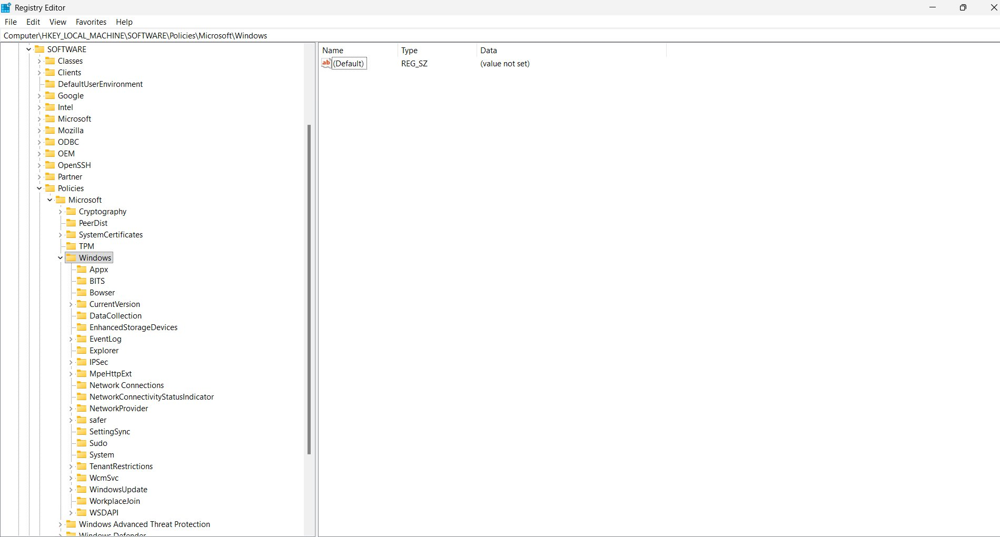

Create `EventLog` key with subkeys `Application`, `Security`, `System`. Inside each, create DWORD (32-bit) `MaxSize`:

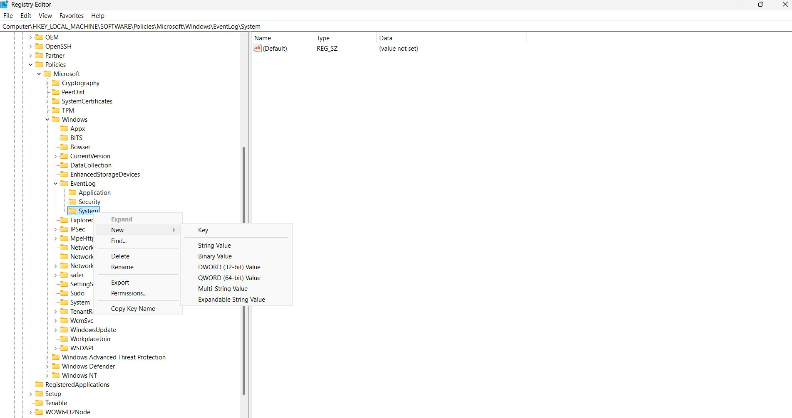

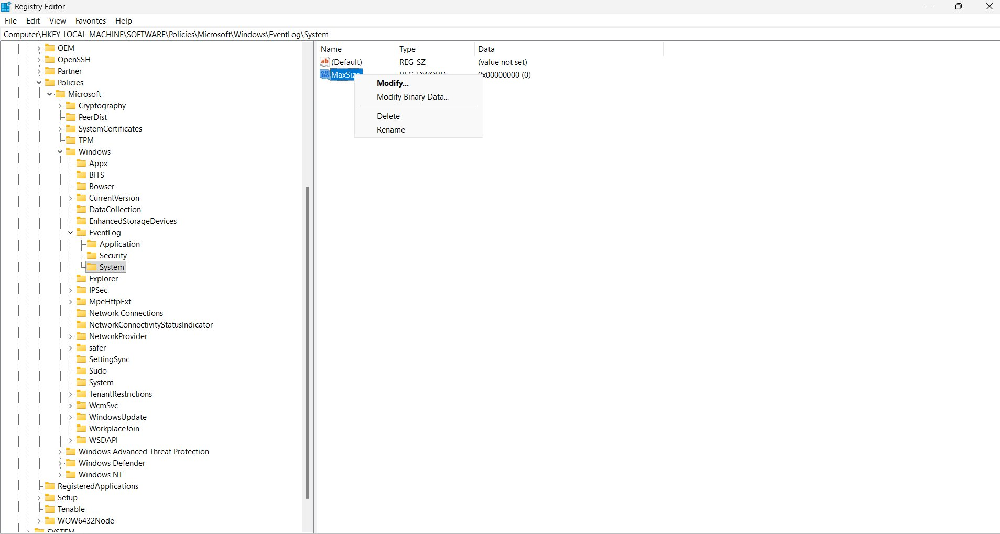

Set decimal values — Application: 32768, Security: 1024000, System: 32768:

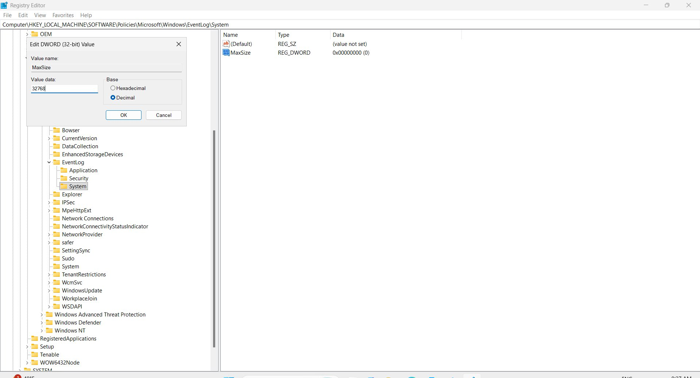

## Tenable — Before Fix (Failed)

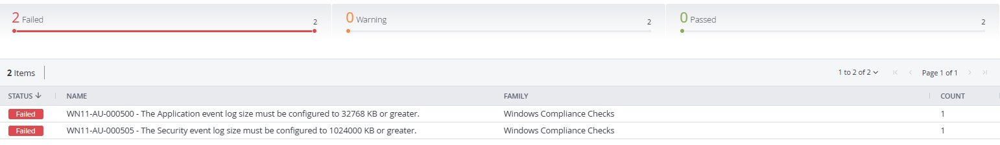

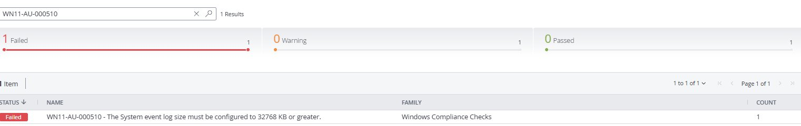

## Tenable — After Manual Fix (Passed)

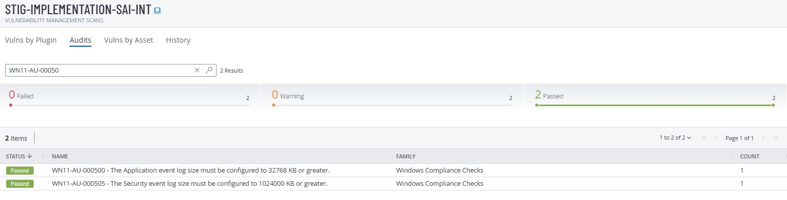

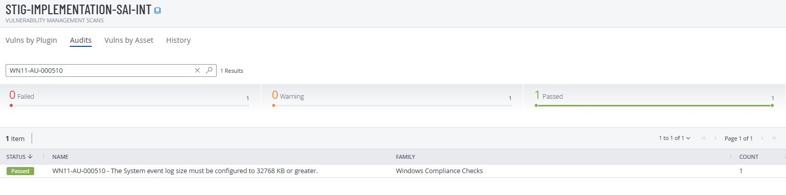

## PowerShell Remediation

```powershell
Set-ExecutionPolicy -ExecutionPolicy RemoteSigned -Scope Process
.\scripts\WN11-AU-EventLog-Sizes.ps1
gpupdate /force
```

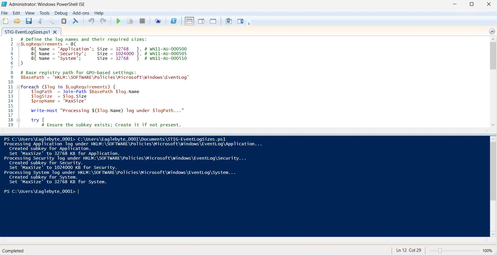

## Verification

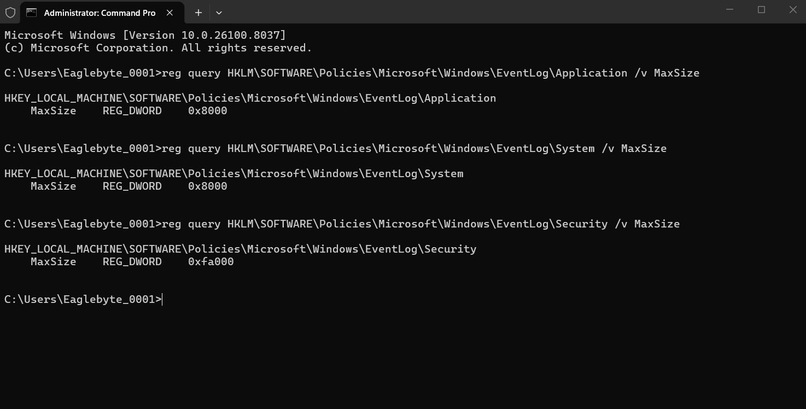

## Tenable — After PowerShell Fix (Passed)

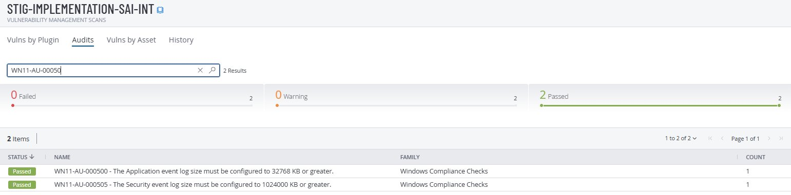

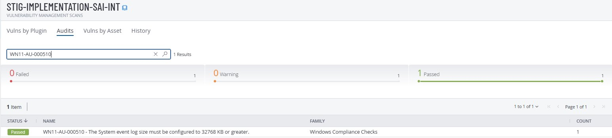

## Rollback

Set all 3 `MaxSize` values back to `20480` in Registry Editor, then run `gpupdate /force`.
