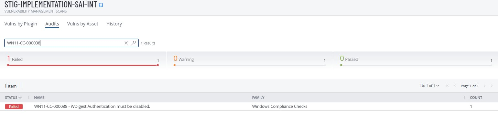
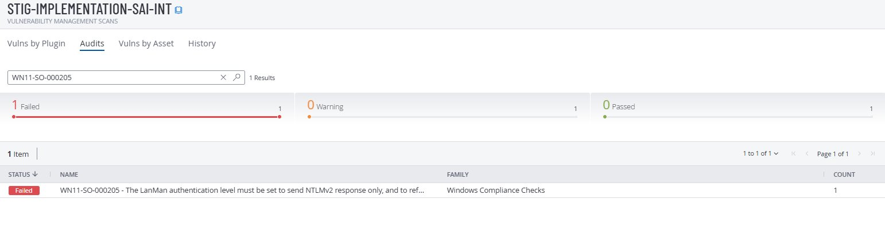
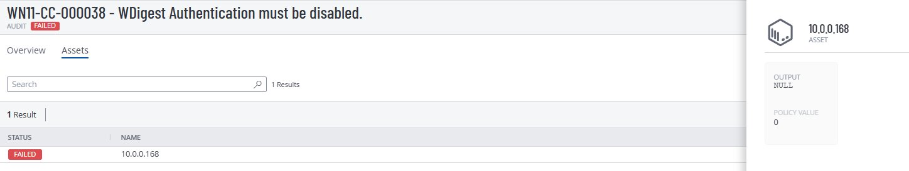
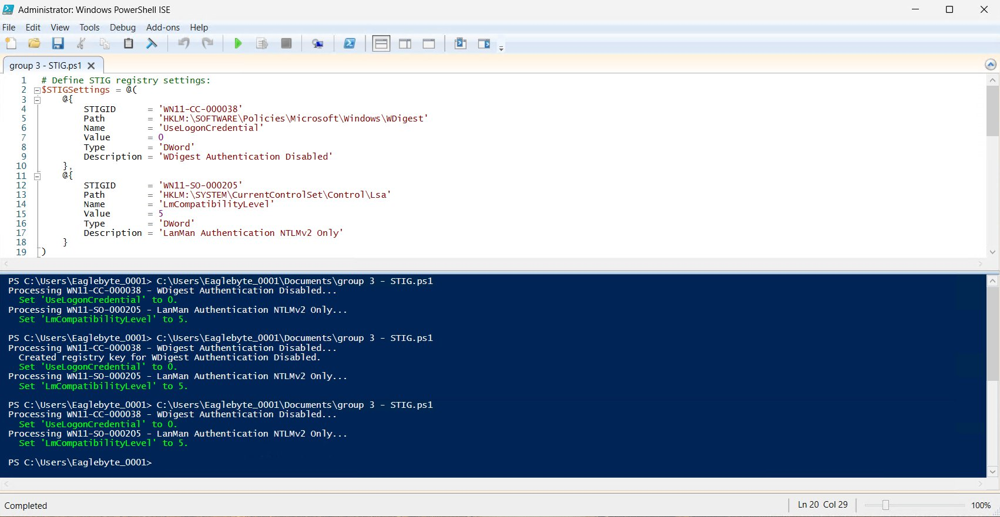
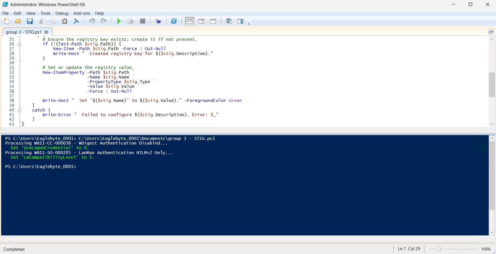
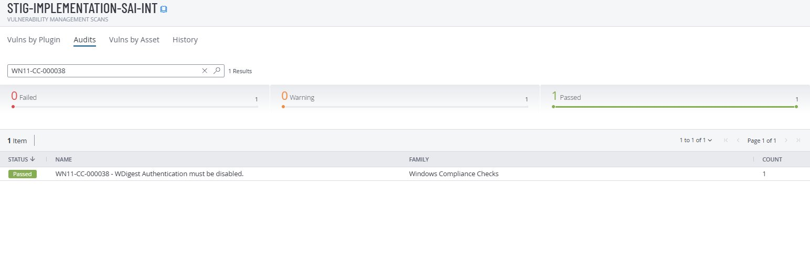
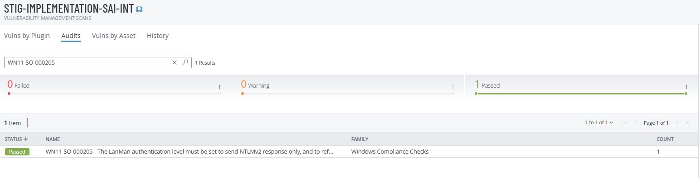

# Group 3 — Credential Security

**STIGs:** WN11-CC-000038 · WN11-SO-000205
**Script:** [`WN11-CC-Credential-Security.ps1`](../scripts/WN11-CC-Credential-Security.ps1)

---

## Vulnerability

| STIG ID | Title | MITRE ATT&CK |
|---------|-------|--------------|
| WN11-CC-000038 | WDigest Authentication must be disabled | T1003.001 — OS Credential Dumping: LSASS Memory |
| WN11-SO-000205 | LanMan authentication level must be NTLMv2 only | T1557.001 — LLMNR/NBT-NS Poisoning and Relay |

## Why This Matters

- **WDigest** stores plaintext passwords in LSASS memory — disabling it means Mimikatz finds nothing useful
- **Forcing NTLMv2 only** prevents relay attacks where an attacker replays captured authentication

## Registry Paths

```
HKLM\SOFTWARE\Policies\Microsoft\Windows\WDigest → UseLogonCredential = 0
HKLM\SYSTEM\CurrentControlSet\Control\Lsa        → LmCompatibilityLevel = 5
```

| LmCompatibilityLevel | Meaning |
|---------------------|---------|
| 0 | Send LM and NTLM (most insecure) |
| 3 | Send NTLMv2 only |
| **5** | **Send NTLMv2, refuse LM and NTLM (STIG required)** |

## Tenable — Before Fix (Failed)







## Manual Remediation

1. Registry Editor → `HKLM\SOFTWARE\Policies\Microsoft\Windows` → create key `WDigest` → DWORD `UseLogonCredential` = `0`
2. Navigate to `HKLM\SYSTEM\CurrentControlSet\Control\Lsa` → DWORD `LmCompatibilityLevel` = `5`
3. Run `gpupdate /force` and restart VM (WDigest requires restart)

## PowerShell Remediation

```powershell
Set-ExecutionPolicy -ExecutionPolicy RemoteSigned -Scope Process
.\scripts\WN11-CC-Credential-Security.ps1
gpupdate /force
Restart-Computer -Force
```





## Tenable — After Fix (Passed)





## Rollback

Set `UseLogonCredential` to `1` and `LmCompatibilityLevel` to `0`, then `gpupdate /force` and restart.
