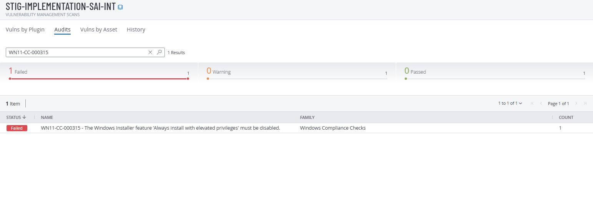
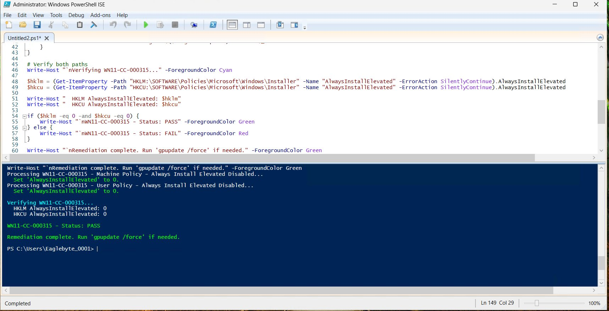
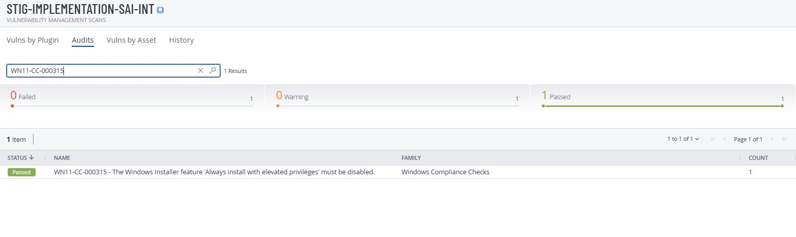

# Group 5 — Installer Privileges

**STIG:** WN11-CC-000315
**Script:** [`WN11-CC-InstallerElevated.ps1`](../scripts/WN11-CC-InstallerElevated.ps1)

---

## Vulnerability

| STIG ID | Title | MITRE ATT&CK |
|---------|-------|--------------|
| WN11-CC-000315 | Windows Installer Always install with elevated privileges must be disabled | T1548.002 — Abuse Elevation Control Mechanism |

## Why This Matters

When `AlwaysInstallElevated` is enabled, any user can run an MSI installer as SYSTEM. Attackers create malicious MSI files that add admin accounts or install backdoors. Both HKLM and HKCU must be set to `0` — if either is missing or `1`, the STIG fails.

## Registry Paths

```
HKLM\SOFTWARE\Policies\Microsoft\Windows\Installer → AlwaysInstallElevated = 0
HKCU\SOFTWARE\Policies\Microsoft\Windows\Installer → AlwaysInstallElevated = 0
```

## Tenable — Before Fix (Failed)



## Manual Remediation

1. Registry Editor → `HKLM\SOFTWARE\Policies\Microsoft\Windows` → create key `Installer` → DWORD `AlwaysInstallElevated` = `0`
2. Same under `HKCU\SOFTWARE\Policies\Microsoft\Windows\Installer` → DWORD `AlwaysInstallElevated` = `0`
3. Run `gpupdate /force`

## PowerShell Remediation

```powershell
Set-ExecutionPolicy -ExecutionPolicy RemoteSigned -Scope Process
.\scripts\WN11-CC-InstallerElevated.ps1
gpupdate /force
```



## Tenable — After Fix (Passed)



## Rollback

Set both `AlwaysInstallElevated` values to `1`, then `gpupdate /force`.
