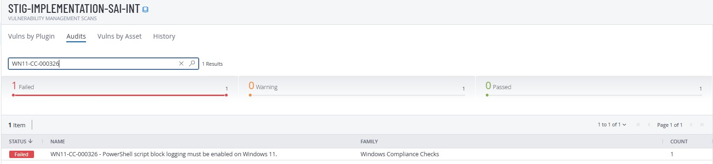
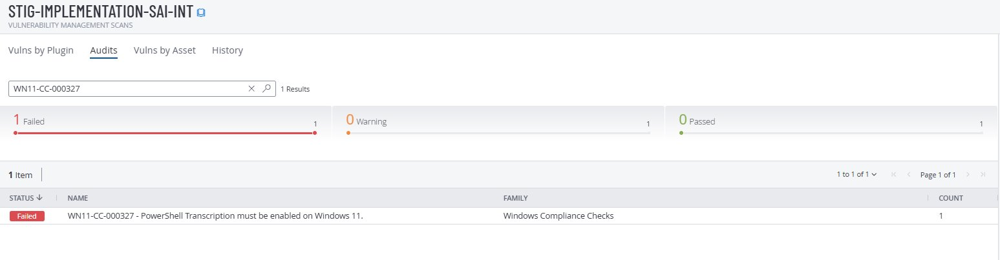
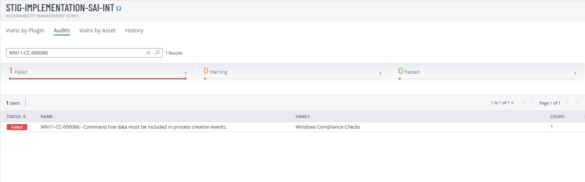
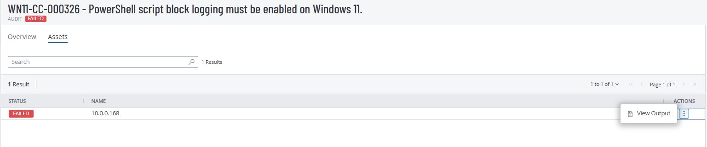
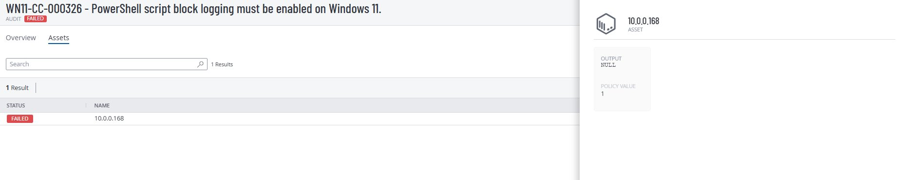
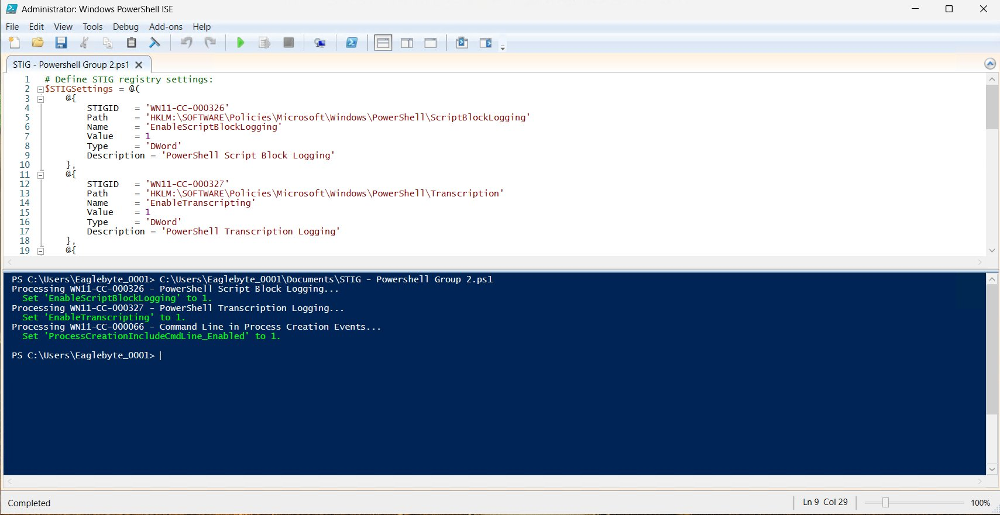
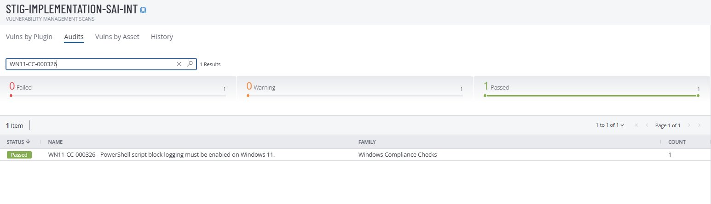
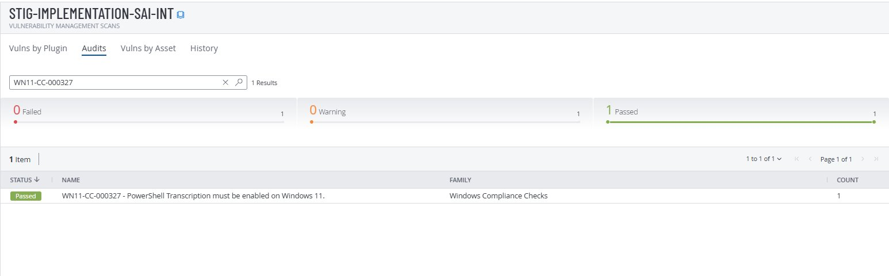
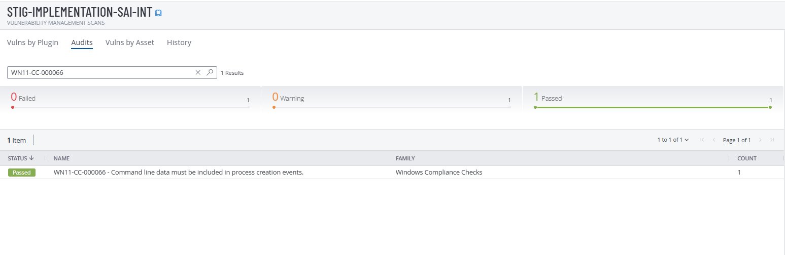

# Group 2 - PowerShell and Command Logging

**STIGs:** WN11-CC-000326 · WN11-CC-000327 · WN11-CC-000066
**Script:** [`WN11-CC-PowerShell-Logging.ps1`](../scripts/WN11-CC-PowerShell-Logging.ps1)

---

## Vulnerability

| STIG ID | Title | MITRE ATT&CK |
|---------|-------|--------------|
| WN11-CC-000326 | PowerShell Script Block Logging must be enabled | T1059.001 — Command and Scripting: PowerShell |
| WN11-CC-000327 | PowerShell Transcription must be enabled | T1059.001 — Command and Scripting: PowerShell |
| WN11-CC-000066 | Command line data must be included in process creation events | T1059.003 — Command and Scripting: Windows Command Shell |

## Why This Matters

PowerShell is used in the majority of modern attacks. These 3 STIGs together give SOC analysts full visibility into PowerShell activity.

- **Script block logging** decodes and records every PowerShell script — including obfuscated ones
- **Transcription logging** records the full session: every command typed and every output returned
- **Command line logging** captures the full arguments of every process that starts

Together, these make PowerShell-based attacks fully visible to threat hunters.

## Registry Paths

```
HKLM\SOFTWARE\Policies\Microsoft\Windows\PowerShell\ScriptBlockLogging → EnableScriptBlockLogging = 1
HKLM\SOFTWARE\Policies\Microsoft\Windows\PowerShell\Transcription       → EnableTranscripting = 1
HKLM\SOFTWARE\Microsoft\Windows\CurrentVersion\Policies\System\Audit    → ProcessCreationIncludeCmdLine_Enabled = 1
```

## Tenable - Before Fix (Failed)







### Detailed Failure View





## Manual Remediation

1. Open Registry Editor. Navigate to `HKEY_LOCAL_MACHINE\SOFTWARE\Policies\Microsoft\Windows`
2. Create key `PowerShell` → subkey `ScriptBlockLogging` → DWORD `EnableScriptBlockLogging` = `1`
3. Create subkey `Transcription` → DWORD `EnableTranscripting` = `1`
4. Navigate to `HKEY_LOCAL_MACHINE\SOFTWARE\Microsoft\Windows\CurrentVersion\Policies\System`
5. Create key `Audit` → DWORD `ProcessCreationIncludeCmdLine_Enabled` = `1`

## PowerShell Remediation

```powershell
Set-ExecutionPolicy -ExecutionPolicy RemoteSigned -Scope Process
.\scripts\WN11-CC-PowerShell-Logging.ps1
gpupdate /force
```



## Tenable - After Fix (Passed)







## Rollback

Set all 3 values to `0` in Registry Editor, then run `gpupdate /force`.
