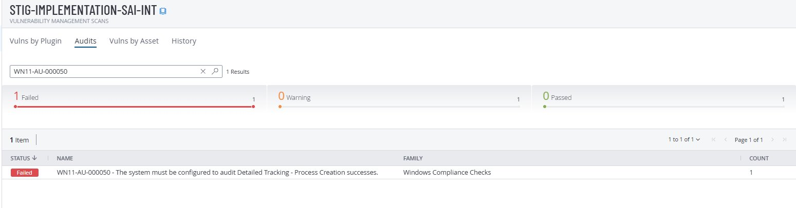
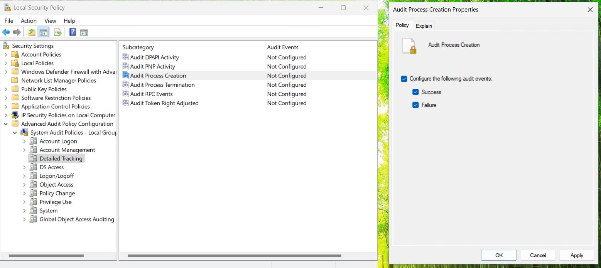
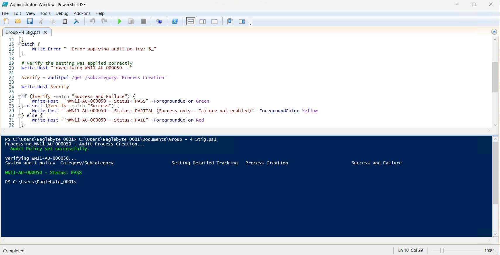
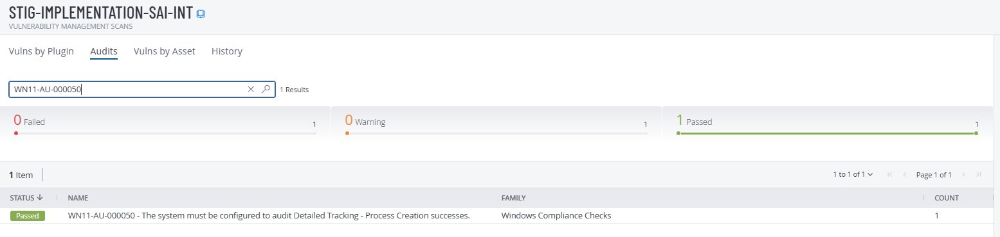

# Group 4 - Process Auditing

**STIG:** WN11-AU-000050
**Script:** [`WN11-AU-ProcessCreation.ps1`](../scripts/WN11-AU-ProcessCreation.ps1)

---

## Vulnerability

| STIG ID | Title | MITRE ATT&CK |
|---------|-------|--------------|
| WN11-AU-000050 | Audit Detailed Tracking — Process Creation must be enabled | T1055 - Process Injection |

## Why This Matters

Every process that starts generates Event ID 4688 when this is enabled. SOC analysts use this to reconstruct attack kill chains — Word spawning PowerShell, PowerShell spawning cmd, cmd running Mimikatz. Without this, the entire process chain is invisible.

## Tenable - Before Fix (Failed)



## Manual Remediation

Open Local Security Policy (`secpol.msc`) → `Advanced Audit Policy Configuration` → `Detailed Tracking` → `Audit Process Creation` → check Success and Failure:



## PowerShell Remediation

```powershell
Set-ExecutionPolicy -ExecutionPolicy RemoteSigned -Scope Process
.\scripts\WN11-AU-ProcessCreation.ps1
gpupdate /force
```



## Tenable - After Fix (Passed)



## Rollback

Open `secpol.msc` → `Detailed Tracking` → uncheck both Success and Failure → `gpupdate /force`.
